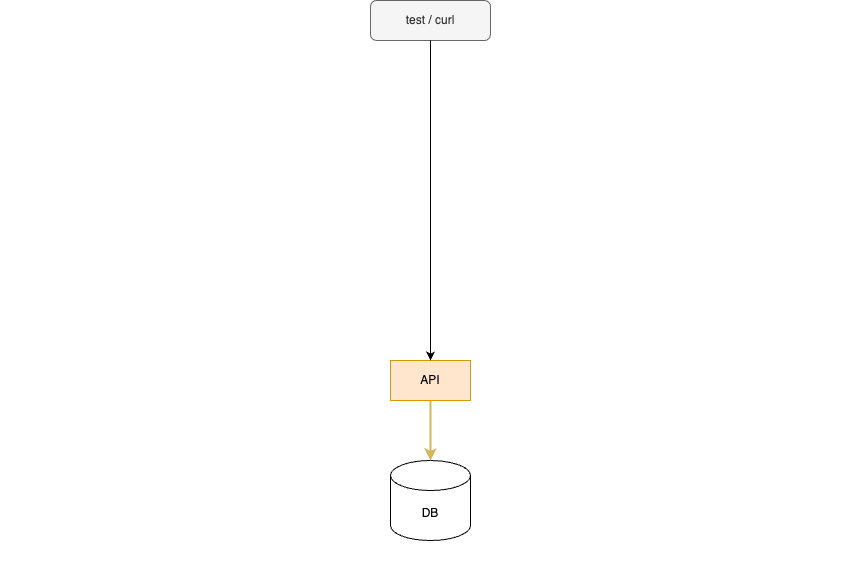
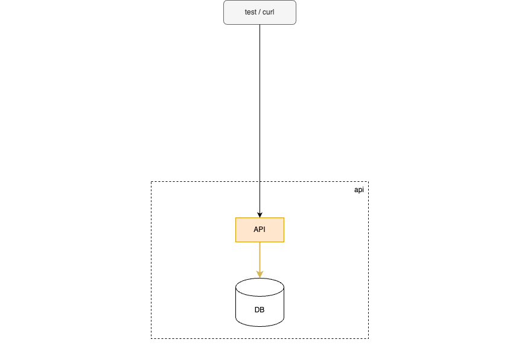
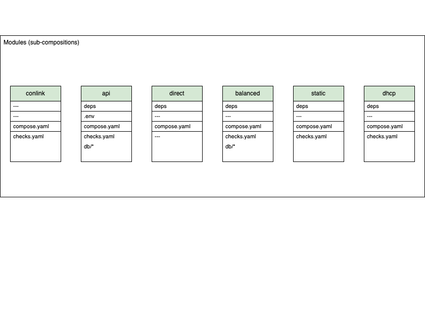
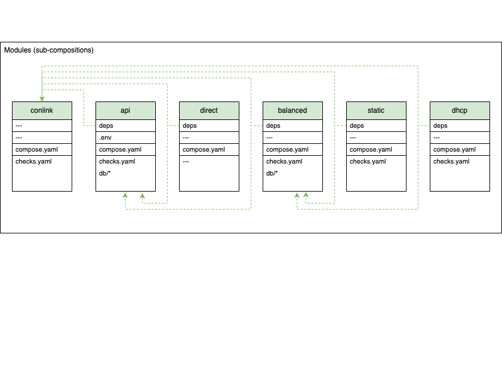
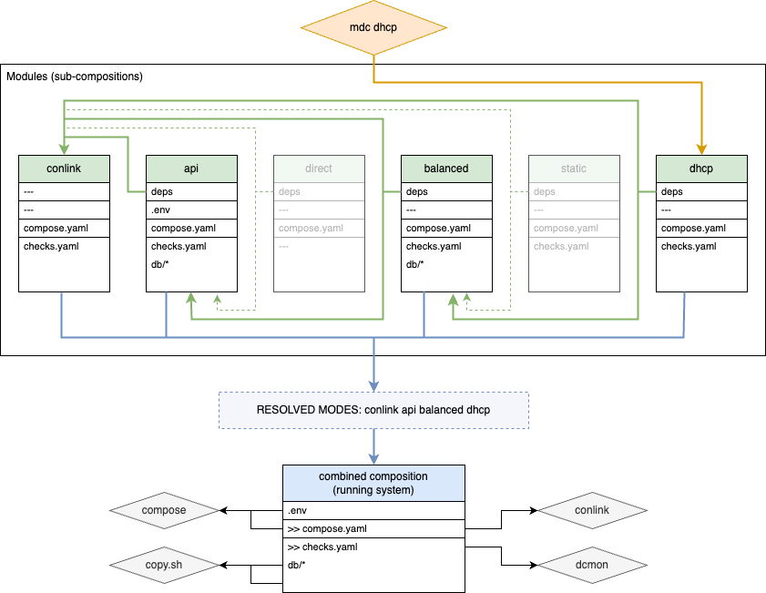
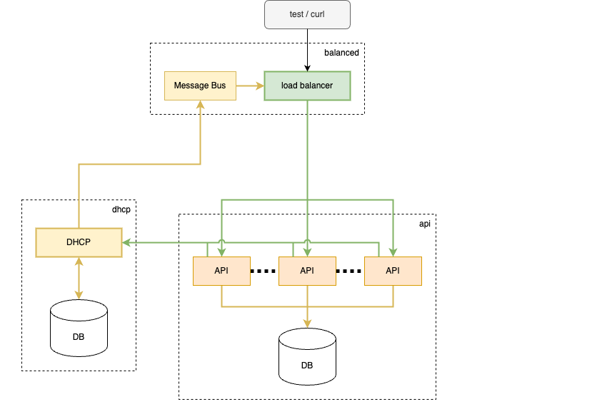
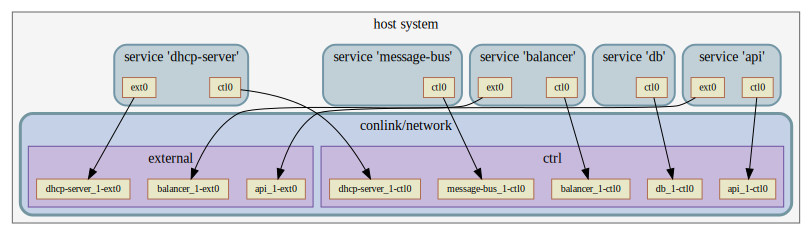

### Tools that Enable Data-Defined and Containerized Testing of Multi-Service Networked Systems

<br>
<br>

<br>
<figure class="fragment">
  
  <figcaption>Image: What this system needs is more YAML!<br>(ChatGPT prompt)</i></figcaption>
</figure>

Notes:
 
* Reset timer
* [Read title]
* Or as this talk could have been titled:
  "What this system needs is more YAML!"
  * But whether you love or hate YAML, I hope you're able to get
    something out of this talk.

-----

### Intro

_Tools that Enable Data-Defined and Containerized Testing of Multi-Service Networked Systems_

- Themes:
  - data-defined
  - containerized
  - clojure


Notes:

- A bit of a mouthful

- Focus of this presentation is on tools.
- However, there are some themes woven through these tools that I want
  to emphasize:
    - data-defined tools development and testing.
    - containerized
    - clojure: the major tools I'm going to show are written in Clojure

---

### What is a data-defined approach?

<br>
<br>

**Data-defined systems put data in control. The data drives the logic
and behavior of the system.**

Notes:

- Other terms in this space that also aren't quite right are
  "data-driven", "declarative", "spec-driven", and "data-first". But
  each of those is a bit of a "term-of-art" with narrower meanings
  than what I'm getting at.
- I've been the fence about which term is best.
- I currently prefer "data-defined" but none is perfect.


---

### Why data-defined?

- Faster dev and test loop
- Greater interoperability and openness
- Easier testing and behavior simulation

<br>
<br>

<div>

Lisp syntax is data-defined!

Clojure:
```clojure
(defmacro unless
  [p a b]
  `(if ~p ~b ~a))
```

</div>
<!-- .element class="fragment" data-fragment-index="1" -->


Notes:


- Faster dev and test loop: less time in compile/build
- Greater interoperability and openness: other tools can consume and generate data
- Easier testing and behavior simulation: especially generative testing

- Given the name on this conference I'm obliged to point out that
  Clojure itself emobodies a data-defined approach.
  - Syntax is data that defines the AST data-structure that will be
    generated in memory.

-----

### Why not data-defined?

- Can be less readable
- Tendency for data sprawl
- Harder to trace and debug

Notes:

- not all roses, there are some potential downsides to data-defined
  approach
- Can be less readable: behavior can be emergent rather hard-coded in code
- Data sprawl: can be harder to determine interactions and
  dependencies between different parts of the data
- Harder to trace and debug: downside of logic and behavior being distinct
    - e.g. a stack trace may point a line of code that is opaque
      without the additional data context

- for the most part, these downsides aren't fundamental but rather
  point to a tooling gap

-----

<br>

### Data-defined protocols
<!-- .slide: class="fullslide" -->

#### [clj-protocol](https://github.com/lonocloud/clj-protocol)

<div class="columns">
  <div class="column column-5">

```clojure
(def MSG-TYPE-LIST
  [;; num, message,         resp,   broadcast
   [1      :DISCOVER        :OFFER   true]
   [2      :OFFER           nil      nil]
   [3      :REQUEST         :ACK     true]
   [4      :DECLINE         nil      nil]
   [5      :ACK             nil      nil]
   [6      :NAK             nil      nil]
   [7      :RELEASE         :ACK     false]
   [8      :INFORM          :ACK     false]
   ...
   ])

(def MSG-TYPE-LOOKUP (fields/list->lookup MSG-TYPE-LIST [0 1] [1 0]))

;; https://datatracker.ietf.org/doc/html/rfc2132
(def OPTS-LIST
  ;; code,  name,              type      extra-context
  [[53  :opt/msg-type          :lookup   {:lookup-type :uint8
                                          :lookup MSG-TYPE-LOOKUP}]
   [1   :opt/netmask           :ipv4     nil]
   [3   :opt/router            :repeat   {:repeat-type :ipv4 :repeat-size 4}]
   [4   :opt/time-servers      :repeat   {:repeat-type :ipv4 :repeat-size 4}]
   [5   :opt/name-servers      :repeat   {:repeat-type :ipv4 :repeat-size 4}]
   [6   :opt/dns-servers       :repeat   {:repeat-type :ipv4 :repeat-size 4}]
   [12  :opt/hostname          :utf8     nil]
   [15  :opt/domainname        :utf8     nil]
   [28  :opt/mtu               :uint16   nil]
   [28  :opt/broadcast         :ipv4     nil]
   [41  :opt/nis-servers       :repeat   {:repeat-type :ipv4 :repeat-size 4}]
   [43  :opt/vend-spec-info    :raw      nil]
   [50  :opt/addr-req          :ipv4     nil]
   [51  :opt/lease-time        :uint32   nil]
   [54  :opt/dhcp-server-id    :ipv4     nil]
   ...
   ])

(def OPTS-LOOKUP (tlvs/tlv-list->lookup OPTS-LIST))


```
<!-- .element class="reduce-font-more" -->

  </div>
  <div class="column column-5">

```clojure
;; https://datatracker.ietf.org/doc/html/rfc2131
(def DHCP-FLAGS [[:broadcast  :bool   1]
                 [:reserved   :int   15]])

(def DHCP-HEADER
;;  name,          type,      extra-context
  [[:op            :uint8     {:default 0}]
   [:htype         :uint8     {:default 1}]
   [:hlen          :uint8     {:default 6}]
   [:hops          :uint8     {:default 0}]
   [:xid           :uint32    {:default 0}]
   [:secs          :uint16    {:default 0}]
   [:flags         :bitfield  {:length 2 :default 0 :spec DHCP-FLAGS}]
   [:ciaddr        :ipv4      {:default "0.0.0.0"}]
   [:yiaddr        :ipv4      {:default "0.0.0.0"}]
   [:siaddr        :ipv4      {:default "0.0.0.0"}] ;; next server
   [:giaddr        :ipv4      {:default "0.0.0.0"}]
   [:chaddr        :mac       {:default "00:00:00:00:00:00"}]
   [:chaddr-extra  :raw       {:length 10 :default [0 0 0 0 0 0 0 0 0 0]}]
   [:sname         :utf8      {:length 64 :default ""}]
   [:bootfile      :utf8      {:length 128 :default ""}] ;; :file
   [:cookie        :raw       {:length 4 :default [99 130 83 99]}]
   [:options       :tlv-map   {:tlv-tsize 1
                               :tlv-lsize 1
                               :lookup OPTS-LOOKUP}]])

(def HEADERS-FIXED {:htype  1
                    :hlen   6
                    :hops   0 ;; fixed until relay supported
                    :cookie [99 130 83 99]}) ;; 0x63825363
```
<!-- .element class="reduce-font-more" -->


  </div>
</div>

Notes:

- a non-trivial data-defined example
- clj-protocol takes a data-defined approach to network protocols
- clj-protocol includes a definition of the DHCP protocol
- sort of looks like it was pulled straight out of standards spec
  document ... well, that's because it essentially was!


---

<br>

### DHCP server implementation
<!-- .slide: class="fullslide" -->

<div class="columns">
  <div class="column column-5">

Postgres IP pool assignment:

```clojure
(defn pg-select-all
  [client table]
  (P/let [result (.query client (str "SELECT * FROM " table ";"))]
    (js->clj (.-rows result) :keywordize-keys true)))

(defn pg-insert-row
  [client table row]
  (P/let [ks (S/join ", " (map name (keys row)))
          vnums (S/join ", " (map #(str "$" %1) (range 1 (inc (count row)))))
          sql (str "INSERT INTO " table " (" ks ")" " VALUES (" vnums ")")
          result (.query client sql (clj->js (vals row)))]
    result))

(defn query-or-assign-ip
  [{:keys [pg-opts pg-table dhcp-cfg]} mac]
  (P/let
    [pg-client (doto (pg.Client. (clj->js pg-opts))
                 .connect)
     rows (pg-select-all pg-client pg-table)
     reassign-ip (:ip (first (filter #(= (:mac %) mac) rows)))
     ip (or reassign-ip
            (P/let [used-set (set (map :ip rows))
                    all-ips (addrs/ip-seq (:start dhcp-cfg) (:end dhcp-cfg))
                    assign-ip (some #(if (contains? used-set %) nil %)
                                    all-ips)
                    res (pg-insert-row pg-client pg-table {:mac mac
                                                           :ip assign-ip})]
              assign-ip))]
    (.end pg-client)
    (when ip
      (merge dhcp-cfg {:ip ip
                       :action (if reassign-ip "Reassigning" "Assigning")}))))

```
<!-- .element class="reduce-font-more" -->

  </div>
  <div class="column column-5">

DHCP message handler and NATS events:

```clojure
(defn nats-publish
  [client subject data]
  (P/let [sc (nats/StringCodec)
          msg (.encode sc (js/JSON.stringify (clj->js data)))]
    (.publish client subject msg)))

(defn pool-handler
  "Takes a parsed DHCP client message `msg-map`, queries the DB
  for assigned IPs or assigns one, sends a NAT event, and then
  responds to the client with the assigned address."
  [{:keys [log-msg server-info nats-cfg nats-client] :as cfg} msg-map]
  (P/let [field-overrides (:fields cfg) ;; config file field/option overrides
          mac (:chaddr msg-map)
          dhcp-cfg (query-or-assign-ip cfg mac)]
    (if (not dhcp-cfg)
      (log-msg :error (str "MAC " mac " could not be queried"))
      (P/let [{:keys [action ip gateway netmask]} dhcp-cfg]
        (when nats-client
          (let [{:keys [server subject target-port]} nats-cfg
                msg {:action "add"
                     :target (str ip ":" target-port)}]
            (log-msg :info (str "Publishing to '" server "': " msg))
            (nats-publish nats-client subject msg)))
        (log-msg :info (str action " " ip "/" netmask " to " mac
                            (when gateway " (gateway " gateway ")")))
        (merge
          (dhcp/default-response msg-map server-info)
          (select-keys msg-map [:giaddr :opt/relay-agent-info])
          {:yiaddr ip
           :opt/netmask netmask}
          (when gateway {:opt/router [gateway]})
          field-overrides)))))
```
<!-- .element class="reduce-font-more" -->


  </div>
</div>

Notes:

- a data-defined approach combined with Clojure gives really flexible
  and powerful way to quickly create service prototypes (or testing
  mocks, etc) for arbitrary binary network protocols
  - Here are 64 lines of code that use the clj-protocol DHCP
    definition to create a DHCP server with IP pool stored in postgres
    and events sent to NATS.

-----

<br>

### The System
<!-- .slide: class="fullslide" data-transition="none" -->


Notes:

- here is the full system that I will be using to demonstrate the
  tools and data-defined approach
- quick summary:
  - DB store
  - Horizontally scale application or API nodes
  - load balancer in front of them
  - app nodes get IP via DHCP
    - this is the data-defined DHCP server shown earlier
  - DHCP server sends api scale events to message bus
  - balancer listens to events and updates target config
  - monitoring on right
  - testing below that
- has many elements of what make a production system difficult to
  understand, develop, test, and debug
    - use this system as a model to show how a data-defined approach
      can help with these problems
    - even this model is too much to start with ...

---

<br>

### The System: simplified
<!-- .slide: class="fullslide" data-transition="none" -->



Notes:

- this is reduced to the functional essentials:
  - data storage and application logic
- how do we configure and instantiate this system in a data-defined
  way?

-----

### Data-defined services

#### [docker compose](http://docs.docker.com/compose)

<div class="columns">

<div class="column column-5">

```yaml
# simple-compose.yaml
services:
  api:
    build: {context: ./app}
    ports:
      - 8000:8000/tcp

  db:
    image: postgres:12
    environment:
      POSTGRES_DB: demo
      POSTGRES_USER: postgres
      POSTGRES_PASSWORD: demo
    volumes:
      - ./modes/api/db/files/docker-entrypoint-initdb.d:/docker-entrypoint-initdb.d


```

</div>

<div class="column column-3">

</div>

</div>

<br>
<br>

#### DB schema and seed data
<!-- .element class="fragment" data-fragment-index="1" -->

<div class="columns fragment" data-fragment-index="1">

<div class="column column-1">

```sql
-- app-01-schema.sql
CREATE TABLE users (
    id SERIAL PRIMARY KEY,
    name VARCHAR(100) NOT NULL,
    email VARCHAR(100) NOT NULL UNIQUE,
    version INTEGER DEFAULT 0
);


```

</div>
<div class="column column-1">

```sql
-- app-02-users.sql
INSERT INTO users (name, email, version) VALUES
('Alice', 'alice@example.com', 0),
('Bob', 'bob@example.com', 0);


```

</div>
</div>

Notes:

- answer: docker-compose
- here is our simplified essentials defined using docker-compose
    - api: builds from a directory, exposes port 8000 to the world
    - db: generic postgres image, with DB setting
    - volume mount of a directory that defines schema and seed data in
      a nearly data-defined way.

-----

<br>

### Data-defined service composition
<!-- .slide: class="fullslide" -->

#### compose overlays (override)
<!-- .slide: class="wideslide" -->

docker compose supports merging of multiple compose files

<div class="columns">

```yaml
services:
  foo:
    image: foo:latest

  bar:
    image: bar:latest
    environment:
      - A=1
      - B=2
```
<!-- .element class="column" -->

<div>+</div> <!-- .element class="column huge-symbol" -->

```yaml
services:
  foo:
    image: foo:2.0.0

  bar:
    environment:
      - B=two
      - C=three
```
<!-- .element class="column" -->

</div>

<div>&darr;</div> <!-- .element class="huge-symbol" -->

```yaml
services:
  foo:
    image: foo:2.0.0

  bar:
    image: bar:latest
    environment:
      A: "1"
      B: two
      C: three


```

Notes:

- docker compose has an override or overlay capability where you can
  merge multiple compose files.

- here is an example two compose files are being merged together
    - essentially docker overlay does a deep merge with array values
      appended and map values merged
- compose overlays have limitations:
  - Unwieldy once you have more than 2 files.
  - No way to represent dependencies.
  - Upper right would not work without one on the left because bar
    does not have an image or build defined.

---

<br>

#### [mdc](https://github.com/lonocloud/conlink/blob/master/mdc) (modular docker compose)
<!-- .slide: class="fullslide" -->

<div class="columns">
  <div class="column column-5">
     
    
    
    
    
  </div>
  <div class="column column-3">
    
    
    
    
    
  </div>
</div>

Notes:

- mdc
    - allows us to define groups of services as modules and then
      we can "compose" them together.
    - [Show modules] Here is collection of modules. Each module is
      a directory containing a docker compose file and other files
      that define the module.
    - [Show deps] mdc includes a dependency resolution mechanism
      (might be hard to see dotted lines)
    - [Show direct] if the user uses mdc to select the direct module,
      then transitive dependencies on the api and conlink modules are
      pulled in
        - on the right you can see that this selects the essential
          functionality parts of the demo system
- So mdc gives us a data-defined way to manage service groups and
  compose them together.
- However, the next problem we need to talk about is docker compose
  networking; it is very limited when it comes to testing more complex
  production networks which leads us to:

---

<br>

### Data-defined module dependencies

#### [resolve-deps](https://github.com/viasat/resolve-deps)

- Used by mdc for module dependency resolution
- Supports alternate deps: `foo|bar`
- Supports order-only (weak) deps: `+foo`

<br>
<br>

<div class="columns">
  <div class="column column-5">


  </div>
  <div class="column column-3">

<br><br>

| module name | `deps` file        |
| ----------- | ------------------ |
| `conlink`   |                    |
| `api`       | `conlink`          |
| `direct`    | `conlink api`      |
| `balanced`  | `conlink api`      |
| `static`    | `conlink balanced` |
| `dhcp`      | `conlink balanced` |
<!-- .element class="reduce-font" -->

  </div>
</div>

Notes:

- Each deps file contains a space separated list of other modules that
  this module depends on.
- Syntax supports alternates using a bar `|`.
  - All alternate paths will be considered and the shortest (fewest
    module) resolution will be selected that still fulfills explicitly
    requested modules.
- Syntax also supports order-only (weak) deps using a `+` prefix.
  - Weak deps must be pulled in by some other dep or explicit user
    request, but if they are then this effects the order.

-----

### Data-defined networks

#### [conlink](https://github.com/lonocloud/conlink)

- docker compose networking limitations:
    - basically layer 3 (IP) only
    - simplistic / flat view of networks and IP ranges
    - lack of control over interface naming or order
- conlink:
    - arbitrary data-defined L2 and L3 networking
    - dynamic container scale/replicas
    - network impairments: delay, drops, corruption, etc

Notes:

- docker compose has major networking limitations
    - basically layer 3 (IP) only
    - simplistic / flat view of networks and IP assignment
    - has ability to link container to more than one network however:
        - no control over interface naming or order
        - scaling service replicas prevents use of user-assigned IPs
          or MAC addresses or port forwarding
- [READ]

---

### enabling conlink

conlink boilerplate:

```yaml
services:
  conlink:
    image: lonocloud/conlink:2.5.3
    cap_add: [SYS_ADMIN, NET_ADMIN, SYS_NICE, NET_BROADCAST, IPC_LOCK,
              SYS_PTRACE, NET_RAW, SYS_RAWIO, SETUID, SETGID]
    security_opt: [ 'apparmor:unconfined' ]
    pid: host
    devices: [ '/dev/net/tun' ] # for ovs-tcpdump
    env_file: ./.env
    volumes:
      - /var/run/docker.sock:/var/run/docker.sock
      - ./:/remote
    working_dir: /remote
    command: /app/build/conlink.js --compose-file ${COMPOSE_FILE:?COMPOSE_FILE must be specified}
```

network configuration:
<!-- .element class="fragment" data-fragment-index="1" -->

```yaml
x-network:
  links:
    - {service: foo, bridge: ctrl, dev: eth0}
    ...

services:
  foo:
    image: foo:latest

  bar:
    image: bar:latest
    x-network:
      links:
        - {bridge: ctrl, dev: eth0}
```
<!-- .element class="reduce-font fragment" data-fragment-index="1" -->

Notes:
- enabling conlink is as simple as adding this boilerplate to your
  compose definition.
    - standard service with some elevated permissions and access to
      host pid namespace
    - mount the docker socket to get events from host docker engine
- can coexist with normal docker networking
  - but typically you'll want to disable docker networking in your
    other services in order to have strong isolation from Internet at
    runtime.
- conlink network configuration in a compose file looks like this:
  - this shows conlink config defined at the top-level and within a service
- can also be specified in separate network config files.

---

<br>

### conlink + mdc
<!-- .slide: class="fullslide" -->

<div class="columns">
  <div class="column column-5">

```yaml
# mdc direct
links:
  - {service: api,           bridge: ctrl,     dev: ctl0, ip: 10.0.0.1/16}
  - {service: db,            bridge: ctrl,     dev: ctl0, ip: 10.0.1.1/16}

  - {service: api,           bridge: external, dev: ext0, ip: 10.1.0.1/16,
     forward: ["8001:8000/tcp"]}
```
<!-- .element class="reduce-font overlap" -->
```yaml
# mdc static
links:
  - {service: api,           bridge: ctrl,     dev: ctl0, ip: 10.0.0.1/16}
  - {service: db,            bridge: ctrl,     dev: ctl0, ip: 10.0.1.1/16}

  - {service: api,           bridge: external, dev: ext0, ip: 10.1.0.1/16}

  - {service: balancer,      bridge: ctrl,     dev: ctl0, ip: 10.0.1.2/16,
     forward: ["8000:80/tcp"]}
  - {service: balancer,      bridge: external, dev: ext0, ip: 10.1.1.2/16}
  - {service: message-bus,   bridge: ctrl,     dev: ctl0, ip: 10.0.1.4/16}

  - {service: static-config, bridge: ctrl,     dev: ctl0, ip: 10.0.1.5/16}
```
<!-- .element class="reduce-font fragment overlap" data-fragment-index="1" -->
```yaml
# mdc dhcp
links:
  - {service: api,           bridge: ctrl,     dev: ctl0, ip: 10.0.0.1/16}
  - {service: db,            bridge: ctrl,     dev: ctl0, ip: 10.0.1.1/16}

  - {service: api,           bridge: external, dev: ext0, ip: 10.1.0.1/16}

  - {service: balancer,      bridge: ctrl,     dev: ctl0, ip: 10.0.1.2/16,
     forward: ["8000:80/tcp"]}
  - {service: balancer,      bridge: external, dev: ext0, ip: 10.1.1.2/16}
  - {service: message-bus,   bridge: ctrl,     dev: ctl0, ip: 10.0.1.4/16}

  - {service: dhcp-server,   bridge: ctrl,     dev: ctl0, ip: 10.0.1.3/16}
  - {service: dhcp-server,   bridge: external, dev: ext0, ip: 10.1.1.3/16}
```
<!-- .element class="reduce-font fragment overlap" data-fragment-index="2" -->
  </div>
  <div class="column column-3">
    
    
    
  </div>
</div>

Notes:

- when we run mdc to select the direct this is the resulting 
  composition that results from merging the conlink configs defined in
  the direct module and the transitive api module:

- here is the result when we select the static module

- and finally the dhcp module

---

#### net2dot



Notes:

- as I mentioned, one advantage of a data-defined approach is the
  inherent openness to be able to use other tools to generate or
  consume the data.
- conlink includes a program called net2dot that will convert the
  conlink network config into GraphViz dot format which can then be
  rendered like this.

-----

### Data-defined system status

#### [dcmon](https://github.com/lonocloud/dcmon)


Checks are data-defined:

```yaml
# modes/balanced/checks.yaml
settings:
  finished: {balancer: "curl api"}

checks:
  balancer:
    - {id: "proxy up",  regex: "Loading success"}
    - {id: "nats up",   regex: "Information for Stream events created"}
    - {id: "nats msg",  regex: "NATS message"}
    - {id: "reloading", regex: "Reloading HAProxy"}
    -
    - {id: "curl api",  cmd: "curl --fail http://localhost:80/users",
                        deps: {balancer: "reloading"}}
```

Notes:

- another challenge when you have lots of services defined in docker
  compose is the flood of logs to analyze to figure out the state of
  the system
- to address that issue dcmon provides a way to define status checks
  and visually represent the whole system in summary form.
- top shows what dcmon output looks like for the dhcp composition.
- bottom shows how those checks are defined for the balancer service
    - most of the checks and regex matches against log output
    - but you can also run commands to do status checks
- checks that are defined within each module are merged together for
  final check composition that dcmon uses.

-----

### Demo: compose, mdc, conlink, dcmon

Notes:
- Let's move on to a demo of mdc, conlink, and dcmon
- <font color="red">[next page]</font>

---
<!-- .slide: class="videoslide" --><video id="video1" autoplay muted></video>

Notes:

- <font color="red">[check shared screen]</font>
- DEMO part 1
  - direct:
    - mdc direct
    - dcmon in one window, then `up --force-recreate`
    - dc logs -f, describe logs
    - `CURL localhost:8001/users`
    - do scale up
        - see conlink create both interfaces (north and south)
    - `CURL localhost:8002/users  # different port, different api
    - `CURL localhost:8003/users -d '{"name":"Kay","email":"k@example.com"}'`
    - `CURL localhost:8001/users`
        - see consistent state across api servers
    - leave up!
  - dhcp:
    - mdc dhcp, up -d, dcmon
    - CURL localhost:8000/users
    - all traffic on conlink configured networks passes through the
      conlink container. This means we can analyze traffic in one
      place.
    - `dc exec conlink tshark -nli any -Y "not (tcp.analysis.retransmission or tcp.analysis.duplicate_ack)" port 5432 or port 4222 or port 67`
        - capture just postgres, NATS, and DHCP backend control
          traffic
        - filter out dups and retransmissions, because we see the same
          packet in multiple places
    - do `dc scale api=3`
        - by having whole system running on single host you get
          - omniscient level view of events and network traffic
          - no timestamp skew due to time skew that's a problem with
            normal distributed systems.
    - leave up!

---
<!-- .slide: class="videoslide" --><video id="video2" autoplay muted></video>

Notes:

- DEMO part 2
    - start up separate independent config to monitor the direct and
      dhcp configs that are still running:
    - mdc monitor, dc up, dc logs -f
    - [switch to present head and show grafana]
        - see a few ms of latency in normal operation for our dhcp and
          direct instances.
        - note that y-axis is logarithmic
    - [switch to slides]
        - `cat modes/impair/compose.yaml`
        - restart dhcp with those modes: `mdc dhcp,impair`
    - [switch to present head and show grafana]
        - base latency of dhcp has jumped to 20+ ms
        - also see periodic spikes into 100s of ms
    - the ability to add network impairments and quickly see the
      results on the behavior of the system is really powerful and
      something that is hard to achieve in production or staging
      environments.
    - <font color="red">[switch to slides]</font>

-----

### Data-defined testing

#### [instacheck](https://github.com/kanaka/instacheck)

* Generative Testing (Property-based Testing).
* Define two things:
  * how to generate tests
    * instacheck defines tests using EBNF
  * how to validate results of those tests
    * Oracle problem
      * Use the simpler configuration as the Oracle! <!-- .element class="fragment" -->

Notes:

- instacheck library provides a method of data-defined testing
- technique it uses is known as generative testing or property-based testing

- in generative testing, rather than defining individual tests, we define:
    - how to generate tests
    - how to validate those tests
- instacheck specifically:
     - traditional approach creates a hierarchy of functions that
       generating tests
        - but in instacheck we define tests using a formal grammar
          language called EBNF
    - define how to validate results
      - Oracle problem: a way to determine if the results are correct
        given the generated test.
      - For complex systems this can be difficult and you can often end
        up defining a whole parallel model for how the system works.
      - for distributed network systems, the problem is often that
        things work in the small but don't when deployed in
        production with all extra complexities that involves.
      - For that situation, we have an answer to the Oracle problem:
          - Use the simpler deployment as the Oracle!
          - And use that to validate the more complex configuration.

---

#### Data-defined generative tests (EBNF)

```ebnf
(* actions.ebnf *)

requests   = '[' request ( ',\n ' request )* ']\n'
request    = '{"method":"POST",' '"path":"/users",'     '"payload":' post-user '}'
           | '{"method":"PUT",'  '"path":"/users/' id '","payload":' put-user '}' (* {:weight 500} *)
           | '{"method":"DELETE",' '"path":"/users/' id '"}'
           | '{"method":"GET",'  '"path":"/users/' id '"}'
           | '{"method":"GET",'  '"path":"/users"}'
post-user  = '{"name":"' name '","email":"' email '"}'
put-user   = post-user
           | '{"name":"' name '"}'
           | '{"email":"' email '"}'
id         = "1" (* {:weight 1000} *)
           | "2" (* {:weight 500} *)
           | "3"
           | "4"
           | "5"
           | "6"
           | "7"
           | "8"
           | "9"
name       = 'Joe ' #"[A-Z]"
email      = 'joe' #"[0-9]" '@example.com'


```

Notes:

- Here is the EBNF grammar for tests that we are going to generate. In
  this case we are generating a JSON list of maps where each map
  defines an HTTP request to send.
- Technically this is an EBNF grammar for a parser that can parse our
  test defintions.
- But instacheck uses this in reverse and output tests that conform to
  the grammar.
- If you look at the rule for IDs right in the middle, it's
  alternation between non-zero the digits.
- Instacheck adds the concept of weights that adjust the probability
  that different options will be chosen during generation.
    - It support inline weights via a special comment syntax and
      external weights files.

---

#### Data-defined test weights (edn)

```clojure
{[:id :alt 0] 1000,
 [:id :alt 1] 500,
 [:id :alt 2] 100,
 [:id :alt 3] 100,
 [:id :alt 4] 100,
 [:id :alt 5] 100,
 [:id :alt 6] 100,
 [:id :alt 7] 100,
 [:id :alt 8] 100,
 [:put-user :alt 0] 100,
 [:put-user :alt 1] 100,
 [:put-user :alt 2] 100,
 [:request :alt 0] 100,
 [:request :alt 1] 500,
 [:request :alt 2] 100,
 [:request :alt 3] 100,
 [:request :alt 4] 100,
 [:requests :cat 2 :star 0] 100,
 [:requests :cat 2 :star nil] 100}

```

Notes:

- Here is an external EDN file that defines weights for the EBNF
  grammar I just displayed.
- instacheck can load a custom weights file to adjust the
  probabilities during test generation.

---

```shell
$ gentest samples
$ cat output/samp-00*
```

```json
[{"method":"PUT","path":"/users/5","payload":{"name":"Joe F","email":"joe8@example.com"}},
 {"method":"GET","path":"/users/8"}]
[{"method":"PUT","path":"/users/1","payload":{"email":"joe0@example.com"}}]
[{"method":"PUT","path":"/users/9","payload":{"name":"Joe I","email":"joe8@example.com"}},
 {"method":"POST","path":"/users","payload":{"name":"Joe J","email":"joe0@example.com"}},
 {"method":"GET","path":"/users"},
 {"method":"PUT","path":"/users/4","payload":{"name":"Joe L","email":"joe2@example.com"}}]
[{"method":"PUT","path":"/users/4","payload":{"email":"joe6@example.com"}}]
[{"method":"PUT","path":"/users/1","payload":{"email":"joe2@example.com"}},
 {"method":"GET","path":"/users"},
 {"method":"PUT","path":"/users/3","payload":{"name":"Joe F","email":"joe6@example.com"}},
 {"method":"PUT","path":"/users/1","payload":{"email":"joe6@example.com"}},
 {"method":"PUT","path":"/users/1","payload":{"name":"Joe D","email":"joe5@example.com"}},
 {"method":"POST","path":"/users","payload":{"name":"Joe I","email":"joe4@example.com"}}]
...
```


Notes:

- gentest is a command that wraps instacheck functionality.
- This shows using gentest to generate raw test cases. On average each
  test case iteration gets bigger or more complicated.
- Greatly increases the probability of finding bugs.
- However, massive test cases are not very useful for testing and
  debug, so instacheck uses shrinking process to search for a simpler
  version of the test case that continue to fail.

-----

### Demo: instacheck/gentest

Notes:
- Now I'm going to demo gentest and instacheck
- <font color="red">[next page]</font>

---
<!-- .slide: class="videoslide" --><video id="video3" autoplay muted></video>


Notes:

- DEMO <font color="red">[check shared screen]</font>
    - restart dhcp without impairments
        - we have two instances running now. The full dhcp system and
          the simple direct instance we are using as a test Oracle.
    - full gentest check against our two instances:<br>
      `gentest check http://localhost:8000 http://localhost:8001`
    - add synthetic bug module (`mdc dhcp,bug`), restart dhcp
    - show testing again
        - failure
            - describe result output
            - SEED: 1729643716824
        - use run command with sample:<br>
          `gentest run http://localhost:8000 http://localhost:8001 output/sample-final` 
    - use parse command to show paths through our grammar:<br>
      `gentest parse http://localhost:8000 http://localhost:8001 output/sample-final`
        - every path and how many times that path was traversed.
        - 0 means that part of grammar was not used by this test case
    - variant of parse cmd to generate a new version of grammar:<br>
      `gentest parse --ebnf-output http://localhost:8000 http://localhost:8001 output/sample-final`
        - all grammar paths that had 0's have been pruned
        - left with a much simpler grammar. Can use it to generate
          probabalistically similar test cases.

-----

### Data-defined test suites

#### [dctest](https://github.com/viasat/dctest)

<div class="columns">
  <div class="column column-5">

```yaml
name: Example Suite

env:
  BAZ: ${{ 1 + 1 }}

tests:

  passing:
    name: Passing test
    steps:
      - exec: node1
        env:
          FOO: bar
        run: |
          [ "${FOO}" == "bar" ]
      - exec: node1
        if: success()
        run: echo "This will be run!"
      - exec: node1
        if: failure()
        run: echo "This will NOT be run!"

  expressions:
    name: Expressions test
    env:
      BAR: ${{ 1 + 1 }}
    steps:
      - exec: node1
        run: [ "2" == "${BAR}" ]
      - exec: node1
        env:
          FOO: ${{ env.BAZ }}
        run: [ "2" == "${{ env.FOO }}" ]


```
<!-- .element class="reduce-font-more" -->

  </div>
  <div class="column column-5">

```yaml
  expect-assertions:
    name: Expect test
    steps:
      - exec: node1
        run: echo -n "2"
        expect: step.stdout == "2"
      - exec: node1
        run: |
          echo -n '{"a": {"b": 3}, "c": "Hello World", "d": [1, 2, 3]}'
        expect:
          - contains(fromJSON(step.stdout).c, "World")
          - fromJSON(step.stdout).d.count() == 3

  repeat:
    name: Repeat test
    steps:
      - exec: node1
        run: rm -f repeat-test-file
      - exec: node1
        repeat: { retries: 2, interval: '1s' }
        run: |
          if [ ! -f repeat-test-file ]; then
            touch repeat-test-file
          else
            echo -n 'Repeated successfully'
          fi
        expect:
          - step.stdout == "Repeated successfully"
      - exec: node1
        run: rm -f repeat-test-file


```
<!-- .element class="reduce-font-more" -->


  </div>
</div>

Notes:

- Once we have data-defined tests, we want to be able to data-define
  test suites. That's what the dctest project is about.
- Unfortunatley, I'm not going to have time to demo it today.
- But this can give you a taste of what it is currently capable of.
- It's a fairly young project and so there is still a lot of key
  functionality on the roadmap. But it's already got some cool
  features and it actively being used and developed. So check it out.

-----

### Tool limitations

(invitation to get involved)
<!-- .element class="reduce-font" -->

- conlink:
    - interfaces appear after the service starts
- mdc
    - algorithmically inneficient
- dcmon:
    - only monitors good conditions
- clj-protocol is not data-defined enough
    - intermingled code
    - expression problem
- instacheck
    - limitations around direct and mutual recursion
    - Clojure only (no ClojureScript support yet)
- dctest:
    - early in development
    - needs fixtures, parameterization, etc

Notes:

- conlink:
    - interfaces appear after the service starts
        - this is reason for the wait.sh script
        - often also need to have custom scripts that wait for
          seeding, schema, migrations, service readiness, etc.
        - currently working on a full event system. Replace
          wait.sh script with static binary that implements full
          event system for startup coordination.
- mdc
    - algorithmically inneficient (order n^2)
- dcmon only monitors good conditions
    - needs warnings and error events too
- clj-protocol is not data-defined enough
    - intermingled code
    - expression problem:
        - can't currently extend protocol except accretively
- instacheck
    - inherits from test.check and has same limitations around
      direct and mutual recursion.
    - currently Clojure only so not directly integratable into
      dctest which is currently clojurescript.
- dctest is early.
    - fixtures.
    - more declarative actions (rather that shell snippets)
    - integrate with openapi perhaps?
    - integrate property-based testing and instacheck

-----

#### Current Project Contributors:

  * Aaron Brooks (Equinix)
  * Joel Martin (Equinix)
  * Jon Smock (Viasat)
  * Norman Morales Suarez (Viasat)
  * Greg Warner (Viasat)

Notes:

- I want to thank the current active contributors to these projects.
- [READ names]

-----

#### Links

* This Presentation: [kanaka.github.io/data-defined-systems/presentations/main](https://kanaka.github.io/data-defined-systems/presentations/main)
* Clojure/conj 2024 Presentation: [kanaka.github.io/data-defined-systems/presentations/conj-2024](https://kanaka.github.io/data-defined-systems/presentations/conj-2024)
* Demo System: [github.com/kanaka/data-defined-systems](https://github.com/kanaka/data-defined-systems)
* Projects:
  * conlink: [lonocloud.github.io/conlink/](https://lonocloud.github.io/conlink/)
  * mdc: [github.com/lonocloud/conlink/blob/master/mdc](https://github.com/lonocloud/conlink/blob/master/mdc)
  * resolve-deps: [github.com/viasat/resolve-deps](https://github.com/viasat/resolve-deps)
  * dcmon: [github.com/lonocloud/dcmon](https://github.com/lonocloud/dcmon)
  * clj-protocol: [github.com/lonocloud/clj-protocol](https://github.com/lonocloud/clj-protocol)
  * instacheck: [github.com/kanaka/instacheck](https://github.com/kanaka/instacheck)
  * dctest: [viasat.github.io/dctest](https://viasat.github.io/dctest)

Notes:

- Here are links to this presentation, the demo system, and the
  varous prresolve-deps](https://github.com/viasat/resolve-deps)ojects.
- These tools are at various stages of maturity but all still
  in-progress.
- If these tools or the data-defined approach is something that
  you get excited about, please let us know, or just start using them
  and contributing and improving them!
- Thanks!

-----

### Questions?

-----

### Extra Slides

-----

### Tools that Enable Data-Defined and Containerized Testing of Multi-Service Networked Systems

Setup Slide

<br>
<br>
<br>
<span>
<button class="start-share-screen" data-targets="video0 video1 video2 video3 video4">Start terminal share</button>
<button class="stop-share-screen" data-targets="video0 video1 video2 video3 video4">Stop terminal share</button>
<br>
<video id="video0" style="width:30%; height:30%;" autoplay muted></video>
</span>
<br>
<!--
<span>
<button class="start-share-screen" data-targets="web0 web1">Start web share</button>
<button class="stop-share-screen" data-targets="web0 web1">Stop web share</button>
<br>
<video id="web0" style="width:30%; height:30%;" autoplay muted></video>
</span>
-->

Notes:

* Setup:
  * Set external HDMI to 1920x1200 (16x10)
  * start split presenter/presentation windows
  * Start two terminals
    * Large font size in one (different desktop) 100x13 x 2
    * Small font size (same desktop as presenter window)
  * Share large terminal
  * Open grafana in audience browser window (make sure logged in)
  * tmix setup:
    * windows: direct, dhcp, monitor
    * export `COMPOSE_PROJECT_NAME` in each
    * make sure right dc is on path
    * clear all frames

-----

### About Joel Martin

* Clojure engineer at LonoCloud in 2011
* LonoCloud was acquired by Viasat in 2013
* Started at Equinix this year (2024)
* PhD in CS in 2019 (Generative Testing of Browser Render Engines)
* Clojurescript-in-Clojurescript (2013 Clojure West)
* Created Make-a-Lisp / mal
* Open source: noVNC, websockify, raft.js, miniMAL, wam

Notes:

* [READ]

-----

### Demo Extras

- static configuration
- dcenter

Notes:

  - static:
    - mdc static
    - dcmon in one window, then `up --force-recreate`
    - dc logs -f, then `CURL localhost:8000/users`
    - dc exec conlink tshark -nli any not ip6
    - CURL localhost:8000/users
    - down   # important!
  - dhcp:
    - mdc dhcp, up -d, dcmon
    - CURL localhost:8000/users
    - `dcenter -n db:ctl0 dhcp-server:ext0 message-bus:ctl0 balancer:ctl0 -- tshark -nli {1} not ip6`


-----

### Other stuff

- net2dot
- dcenter
- wait.sh
- copy.sh

-----
<!-- .slide: class="videoslide" --><video id="video4" autoplay muted></video><br/>
<button class="start-share-screen" data-targets="video0 video1 video2 video3 video4 video5">Start Share</button>

-----

### Slide with shared screen

<ul>
<video id="video6" style="float:right; height:30%; width:30%;" autoplay muted></video>
<li> bullet 1 </li> <!-- .element class="fragment" -->
<li> bullet 2 </li> <!-- .element class="fragment" -->
<li> bullet 3 </li>  <!-- .element class="fragment" -->
</ul>

-----
<!-- .slide: class="videoslide" --><video id="web1" autoplay muted></video>

Notes:
* another notes area for web1 video element

