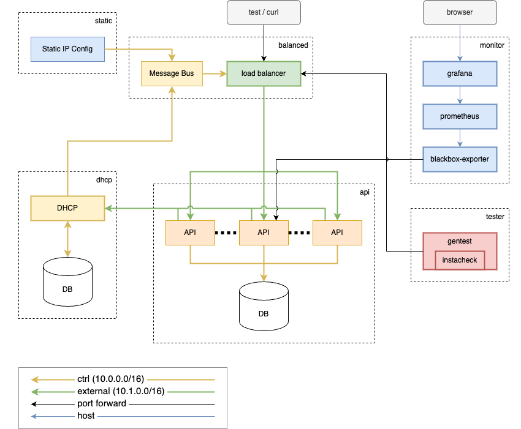

### Tools that Enable Data-Defined and Containerized Testing of Multi-Service Networked Systems

<br>
<br>

Clojure/conj 2024

*Joel Martin*

Notes:

* Setup:
  * start split presenter/presentation windows
  * Share windows
  * Solarized light
  * reset timer

---

### Who am I

* Clojure engineer at LonoCloud in 2011
* LonoCloud was acquired by Viasat in 2013
* Started at Equinix this year (2024)
* PhD in CS in 2019 (Generative Testing of Browser Render Engines)
* Clojurescript-in-Clojurescript (2013 Clojure West)
* Created Make-a-Lisp / mal (Clojure West 2014 lightning talk)
* Open source: noVNC, websockify, raft.js, miniMAL, wac, wam
* Today I will cover some other open source projects

Notes:

- start with a quick personal intro

---

### Data-defined Systems

- Tools and demo focused
- Overarching Themes:
  - data-defined
  - containerization
- Lisp syntax is data

```json
["def", "unless",
  ["~",
    ["fn", ["p","a","b"],
      ["list", ["`", "if"], "p", "b", "a"]]]]
```
<!-- .element class="fragment" -->

Notes:

- Focus of this presentation is on tools so it will be demo heavy.
- However, there is a theme woven through these tools that I want to
  emphasize: data-defined systems development and testing.
- Both "data-driven" and "data-defined" are already overloaded
  terms.
    - "Data-defined" is probably better than what's currently in the
      abstract.
    - "Data-first" is another option. But what I mean by that is:
- Something else that is data-defined: Clojure!
    - sexprs are the data-structure (AST) of the program.
    - Take to extreme: miniMAL (show some miniMAL code)
- Explicit vs implicit.

---

### The System
<!-- .slide: class="fullelement" data-transition="none" -->



Notes:
- here is the full system that I will be showing
- showing we development and test it in a data-defined way

---

### The System: simplified
<!-- .slide: class="fullelement" data-transition="none" -->


-----

### Data-defined services: <a href="http://docs.docker.com/compose">docker compose</a>

```yaml
# simple-compose.yaml
services:
  api:
    build: {context: ./app}
    ports:
      - 8000:8000/tcp

  db:
    image: postgres:12
    environment:
      POSTGRES_DB: demo
      POSTGRES_USER: postgres
      POSTGRES_PASSWORD: demo
    volumes:
      - ./modes/api/db/files/docker-entrypoint-initdb.d:/docker-entrypoint-initdb.d


```

```sql
-- app-01-schema.sql
CREATE TABLE users (
    id SERIAL PRIMARY KEY,
    name VARCHAR(100) NOT NULL,
    email VARCHAR(100) NOT NULL UNIQUE,
    version INTEGER DEFAULT 0
);


```
<!-- .element class="fragment" -->

```sql
-- app-02-users.sql
INSERT INTO users (name, email, version) VALUES
('Alice', 'alice@example.com', 0),
('Bob', 'bob@example.com', 0);


```
<!-- .element class="fragment" -->

Notes:
- here is the very simple view of the system show earlier
- docker compose has network limitations
    - simplistic / flat view of networks
    - basically layer 3 only
    - no control over interface naming or order

-----

### Data-defined networks: [conlink](https://github.com/lonocloud/conlink)

```yaml

links:
  - {service: api,           bridge: ctrl,     dev: ctl0, ip: 10.0.0.1/16}
  - {service: db,            bridge: ctrl,     dev: ctl0, ip: 10.0.1.1/16}

  - {service: api,           bridge: external, dev: ext0, ip: 10.1.0.1/16,
     forward: ["8001:8000/tcp"]}


```

```yaml

links:
  - {service: api,           bridge: ctrl,     dev: ctl0, ip: 10.0.0.1/16}
  - {service: db,            bridge: ctrl,     dev: ctl0, ip: 10.0.1.1/16}

  - {service: balancer,      bridge: ctrl,     dev: ctl0, ip: 10.0.1.2/16,
     forward: ["8000:80/tcp"]}
  - {service: balancer,      bridge: external, dev: ext0, ip: 10.1.1.2/16}
  - {service: message-bus,   bridge: ctrl,     dev: ctl0, ip: 10.0.1.4/16}

  - {service: api,           bridge: external, dev: ext0, ip: 10.1.0.1/16}
  - {service: static-config, bridge: ctrl,     dev: ctl0, ip: 10.0.1.5/16}


```

- arbitrary L2 and L3 networks
- supports dynamic container scale/replicas
- external connectivity: tunnels, macvlan, ipvlan

Notes:

- show how to add conlink (boilerplate service + network_mode: none)
- conlink can connect into external services
- problems with docker compose (not L2, simplistic PAM)
- network configuration is defined either inline (x-network)
  or separate files
    - different compose files and network files are merged
      together in dependency order.
    - later definitions can override or extend earlier ones.

-----

### Data-defined service composition

---

#### compose overlays (override)

Notes:
- blah

---

#### mdc (modular docker compose)

- [image of demo modes being combined]
- [demo diagram showing modes]

Notes:

- docker compose has an override or overlay capability where you can
  merge multiple compose files.
- compose overlays have limitations:
  - Unwieldy once you have more than 2 files.
  - No way to represent dependencies.
- mdc
    - allows us to define groups of services as modules and then
      we can "compose" them together. Includes dependency
      resolution of modules(features / virtual modules)
    - modules as groups of components (features)
    - show the data-defined dependency definition (resolve-deps)
        - both the simple deps file syntax and full json/yaml
        - equivalent implementation in both clojurescript and python
    - other modules are more of feature virtual modules
      - pull in other transitive dependencies
    - show simpler demo/diagram scenarios:
        - static IP configuration but still with load balancer
        - direct: single app/API server, no switch, no DHCP or
          message bus.
- problems docker compose networking: limited when it comes to
  testing more complex production networks which leads us to:

-----

### Data-defined system status

#### dcmon

Notes:

- useful for visual feedback
- but also has event per line output
- the finished settings useful for testing up condition

-----

### Data-defined protocols

#### clj-protocol

Notes:

- show the definition of DHCP protocol
- data-defined combined with Clojure gives really flexible and
  powerful way to quickly create service prototypes (or
  testing mocks, etc) for arbitrary binary network protocols
    - show simple message reponse routines
    - show easy hook with postgres and nats

-----

### Data-defined testing

#### instacheck

Notes:

- Not just static tests, but PBT/generative tests in data-defined
  way
- quick overview of instacheck
- demo tester module
    - oracle problem
        - Scenario: Bug that only happens in full scaled
          production deployments. We suspect a bug that
          happens with certain sequences of requests but
          nobody has been able to pinpoint the issue yet and
          it seems a bit non-deterministic.
        - We want to try generative property-based testing,
          but the problem is when we generate a request
          sequence, what is the right answer?
        - Well in this particular scenario where we have a bug
          that only happens in production, we have an Oracle:
          the simpler configuration.
    - start up direct and balanced instances
    - show success tests again
    - add buggy module
    - show testing again
        - run a few times to show bigger "shrink" and smaller
          shrunk case
    - load weights from existing failures for faster reproduction
        - show faster/better reproduction
        - capture/show response logs and what is actually
          different
        - show --ebnf-output with EBNF rewritten to remove paths
          with 0 weight

-----

### Data-defined testing

#### dctest

Notes:

- ...
- show running in CI

-----
<!-- .slide: class="fullelement" --><video id="video1" autoplay muted></video><br/>
<button class="start-share-screen" data-targets="video1 video2 video3 video4">Start Share</button>

-----

### Slide with shared screen

<ul>
<video id="video2" style="float:right; height:30%; width:30%;" autoplay muted></video>
<li> bullet 1 </li> <!-- .element class="fragment" -->
<li> bullet 2 </li> <!-- .element class="fragment" -->
<li> bullet 3 </li>  <!-- .element class="fragment" -->
</ul>

-----

### Another slide with shared screen

<ul>
<video id="video3" style="float:right; height:30%; width:30%;" autoplay muted></video>
<li> bullet 1 </li>  <!-- .element class="fragment" -->
<li> bullet 2 </li>  <!-- .element class="fragment" -->
<li> bullet 3 </li>  <!-- .element class="fragment" -->
</ul>

Notes:
* first line in notes area
* second line in notes area

-----
<!-- .slide: class="fullelement" --><video id="web1" autoplay muted></video>

Notes:
* another notes area for web1 video element

-----
<!-- .slide: class="fullelement" --><video id="video4" autoplay muted></video>

Notes:
* Demo part 2

-----
<span>
<button class="start-share-screen" data-targets="video0 video1 video2 video3 video4">Start terminal share</button>
<button class="stop-share-screen" data-targets="video0 video1 video2 video3 video4">Stop terminal share</button>
<br>
<video id="video0" style="width:30%; height:30%;" autoplay muted></video>
</span>
<br>
<span>
<button class="start-share-screen" data-targets="web0 web1">Start web share</button>
<button class="stop-share-screen" data-targets="web0 web1">Stop web share</button>
<br>
<video id="web0" style="width:30%; height:30%;" autoplay muted></video>
</span>
