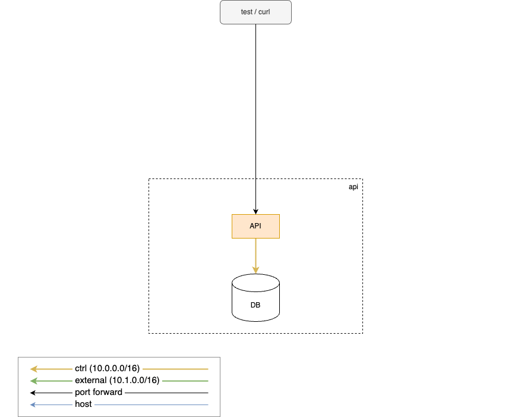
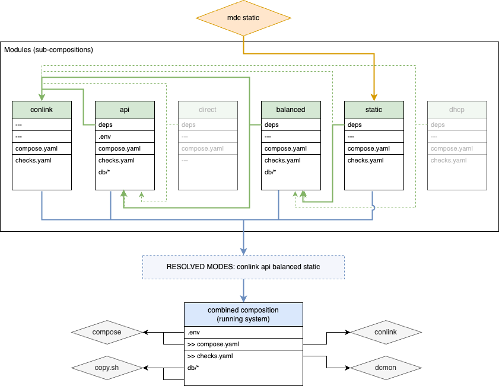

### Tools that Enable Data-Defined and Containerized Testing of Multi-Service Networked Systems

<br>
<br>

Clojure/conj 2024

*Joel Martin*

Notes:

* Setup:
  * start split presenter/presentation windows
  * Start tmix and windows in terminal
    * Large font size
    * Solarized light
  * Share terminal window
  * Reset timer

---

### About Me

* Clojure engineer at LonoCloud in 2011
* LonoCloud was acquired by Viasat in 2013
* Started at Equinix this year (2024)
* PhD in CS in 2019 (Generative Testing of Browser Render Engines)
* Clojurescript-in-Clojurescript (2013 Clojure West)
* Created Make-a-Lisp / mal (Clojure West 2014 lightning talk)
* Open source: noVNC, websockify, raft.js, miniMAL, wac, wam
* Today I will cover some other open source projects

Notes:

- start with a quick personal intro

---

### Intro

_Tools that Enable Data-Defined and Containerized Testing of Multi-Service Networked Systems_

- Tools heavy and demo focused
- Themes:
  - data-defined
  - containerization
  - clojure

Notes:

- A bit of a mouthful

- Focus of this presentation is on tools so it will be demo heavy.
- However, there are themes woven through these tools that I want to
  emphasize:
    - data-defined tools development and testing.
    - containerization
    - clojure: the major tools I'm going to show are written in Clojure

---

### What is a data-defined approach?

<br>
<br>

**Data-defined systems put data in control, driving both the logic and
behavior.**

Notes:

- Both "data-driven" and "data-defined" are already overloaded
  term or art in some contexts. Other terms in this space that also
  aren't quite right are "declarative", "spec-driven", and "data-first".
- "Data-defined" is probably better than what's currently in the
  abstract. So I'm going to use that going forward.

---

### Why data-defined?

- Faster dev and test loop
- Greater interoperability and openness
- Easier testing and behavior simulation
- Separation of concerns
- Explicit vs implicit

<br>
<br>

<div>

Lisp syntax is data-defined!

Clojure:
```clojure
(defmacro unless
  [p a b]
  `(if ~p ~b ~a))
```
</div>
<!-- .element class="fragment" data-fragment-index="1" -->

<div>

miniMAL:
```json
["def", "unless", ["~",
  ["fn", ["p","a","b"],
    ["list", ["`", "if"], "p", "b", "a"]]]]
```

</div>
<!-- .element class="fragment" data-fragment-index="2" -->

Notes:


- Faster dev and test loop: less time in compile/build
- Greater interoperability and openness: other tools can consume and generate data
- Easier testing and behavior simulation: especially generative testing
- Separation of concerns: logic and behavior are more distinct
- Explicit vs implicit: logic is less hidden within code


- Since this is a Clojure conference I feel obliged to mention
  something else that is data-defined: Clojure!
    - sexprs are the data-structure (AST) of the program.
    - Take to extreme: miniMAL (show some miniMAL code)

---

### Why not data-defined?

- Less readable
- Data sprawl
- Harder to trace and debug

Notes:

- Less readable: behavior can be emergent rather hard-coded in code
- Data sprawl: hard to determine interactions and dependencies between
  different parts of the data
- Harder to trace and debug: downside of logic and behavior being distinct

- what a lot of the downsides boil down to a tooling gap

-----

### The System
<!-- .slide: class="fullslide" data-transition="none" -->


Notes:
- here is the full system that I will be using to demonstrate the
  tools and data-defined philosophy
- quick summary:
  - DB store
  - Horizontally scale application or API nodes
  - load balancer in front of them
  - app nodes get IP via DHCP
  - DHCP sends events to message bus
  - balancer listens to events and updates target config
  - monitoring on right
  - testing below that
- showing how to develop and test it in a data-defined way

---

### The System: simplified
<!-- .slide: class="fullslide" data-transition="none" -->


Notes:

- this is reduced to the functional essentials:
  - data storage and application logic

-----

### Data-defined services: [docker compose](http://docs.docker.com/compose)

<div class="columns">

<div class="column column-5">

```yaml
# simple-compose.yaml
services:
  api:
    build: {context: ./app}
    ports:
      - 8000:8000/tcp

  db:
    image: postgres:12
    environment:
      POSTGRES_DB: demo
      POSTGRES_USER: postgres
      POSTGRES_PASSWORD: demo
    volumes:
      - ./modes/api/db/files/docker-entrypoint-initdb.d:/docker-entrypoint-initdb.d


```

</div>

<div class="column column-2">

</div>

</div>

<br>
<br>

#### DB schema and seed data
<!-- .element class="fragment" data-fragment-index="1" -->

<div class="columns fragment" data-fragment-index="1">

<div class="column column-1">

```sql
-- app-01-schema.sql
CREATE TABLE users (
    id SERIAL PRIMARY KEY,
    name VARCHAR(100) NOT NULL,
    email VARCHAR(100) NOT NULL UNIQUE,
    version INTEGER DEFAULT 0
);


```

</div>
<div class="column column-1">

```sql
-- app-02-users.sql
INSERT INTO users (name, email, version) VALUES
('Alice', 'alice@example.com', 0),
('Bob', 'bob@example.com', 0);


```

</div>
</div>

Notes:
- here is the compose view of the simplified system
- DEMO:

<code>
docker compose -f simple-compose.yaml up --force-recreate  # LEFT
CURL localhost:8000/users  # RIGHT
CURL localhost:8000/users -d '{"name":"Kay","email":"k@example.com"}'  # RIGHT
CURL localhost:8000/users  # RIGHT
Ctrl-C  # LEFT
<code>

-----

### Data-defined service composition
<!-- .slide: class="fullslide" -->

---

#### compose overlays (override)

<div class="columns">

```yaml
services:
  foo:
    image: foo:latest

  bar:
    image: bar:latest
    environment:
      - A=1
      - B=2
```
<!-- .element class="column" -->

<div>+</div> <!-- .element class="column huge-symbol" -->

```yaml
services:
  foo:
    image: foo:2.0.0

  bar:
    environment:
      - B=two
      - C=three
```
<!-- .element class="column" -->

</div>

<div>&darr;</div> <!-- .element class="huge-symbol" -->

```yaml
services:
  foo:
    image: foo:2.0.0

  bar:
    environment:
      A: "1"
      B: two
      C: three
    image: bar:latest


```

Notes:

- docker compose has an override or overlay capability where you can
  merge multiple compose files.
- compose overlays have limitations:
  - Unwieldy once you have more than 2 files.
  - No way to represent dependencies.

---

#### [mdc](https://github.com/lonocloud/conlink/blob/master/mdc) (modular docker compose)
<!-- .slide: class="fullslide" -->

<div class="columns">
  <div class="column column-5">
      <!-- .element class="fragment overlap" data-fragment-index="1" -->
       <!-- .element class="fragment overlap" data-fragment-index="2" -->
     <!-- .element class="fragment overlap" data-fragment-index="3" -->
     <!-- .element class="fragment overlap" data-fragment-index="4" -->
       <!-- .element class="fragment overlap" data-fragment-index="5" -->
  </div>
  <div class="column column-3">
      <!-- .element class="fragment overlap" data-fragment-index="1" -->
      <!-- .element class="fragment overlap" data-fragment-index="2" -->
     <!-- .element class="fragment overlap" data-fragment-index="3" -->
     <!-- .element class="fragment overlap" data-fragment-index="4" -->
       <!-- .element class="fragment overlap" data-fragment-index="5" -->
  </div>
</div>

Notes:

- mdc
    - allows us to define groups of services as modules and then
      we can "compose" them together. Includes dependency
      resolution of modules(features / virtual modules)
    - modules as groups of components (features)
    - show the data-defined dependency definition (resolve-deps)
        - both the simple deps file syntax and full json/yaml
        - equivalent implementation in both clojurescript and python
    - other modules are more of feature virtual modules
        - pull in other transitive dependencies
    - show simpler demo/diagram scenarios:
        - static IP configuration but still with load balancer
        - direct: single app/API server, no switch, no DHCP or
          message bus.
- problems docker compose networking: limited when it comes to
  testing more complex production networks which leads us to:

-----

### Data-defined networks

#### [conlink](https://github.com/lonocloud/conlink)

- easy to add to existing docker compose
- arbitrary L2 and L3 networks
- overlay / merge from multiple sources
- dynamic container scale/replicas
- external connectivity: tunnels, macvlan, ipvlan
- network impairments (delay, drops, corruption, etc)

Notes:

- docker compose has major networking limitations
    - basically layer 3 (IP) only
    - simplistic / flat view of networks and IP assignment
    - no control over interface naming or order
    - scaling service replicas prevents use of user-assigned IPs or
      MAC addresses or port forwarding
- READ
- network configuration is defined either inline (x-network)
  or separate files
    - different compose files and network files are merged
      together in dependency order.
    - later definitions can override or extend earlier ones.

---

### enabling conlink

conlink boilerplate:

```yaml
services:
  conlink:
    image: lonocloud/conlink:2.5.3
    cap_add: [SYS_ADMIN, NET_ADMIN, SYS_NICE, NET_BROADCAST, IPC_LOCK,
              SYS_PTRACE, NET_RAW, SYS_RAWIO, SETUID, SETGID]
    security_opt: [ 'apparmor:unconfined' ]
    pid: host
    devices: [ '/dev/net/tun' ] # for ovs-tcpdump
    env_file: ./.env
    volumes:
      - /var/run/docker.sock:/var/run/docker.sock
      - ./:/remote
    working_dir: /remote
    command: /app/build/conlink.js --compose-file ${COMPOSE_FILE:?COMPOSE_FILE must be specified}
```

network configuration:

```yaml
x-network:
  links:
    - {service: foo, bridge: ctrl, dev: eth0}
    ...

services:
  foo:
    image: foo:latest

  bar:
    image: bar:latest
    x-network:
      links:
        - {bridge: ctrl, dev: eth0}
```
<!-- .element class="reduce-font fragment" -->

Notes:
- can coexist with normal docker networking
  - but typically you'll want to disable docker networking in your
    other containers for strong isolation from Internet at runtime.
- easy to add the boilerplate
    - standard service with some elevated permissions
    - mount the docker socket to get events from host docker engine

---

### conlink + mdc
<!-- .slide: class="fullslide" -->

<div class="columns">
  <div class="column column-5">

```yaml
links:
  - {service: api,           bridge: ctrl,     dev: ctl0, ip: 10.0.0.1/16}
  - {service: db,            bridge: ctrl,     dev: ctl0, ip: 10.0.1.1/16}

  - {service: api,           bridge: external, dev: ext0, ip: 10.1.0.1/16, forward: ["8001:8000/tcp"]}
```
<!-- .element class="reduce-font fragment overlap" data-fragment-index="1" -->
```yaml
links:
  - {service: api,           bridge: ctrl,     dev: ctl0, ip: 10.0.0.1/16}
  - {service: db,            bridge: ctrl,     dev: ctl0, ip: 10.0.1.1/16}

  - {service: api,           bridge: external, dev: ext0, ip: 10.1.0.1/16}

  - {service: balancer,      bridge: ctrl,     dev: ctl0, ip: 10.0.1.2/16, forward: ["8000:80/tcp"]}
  - {service: balancer,      bridge: external, dev: ext0, ip: 10.1.1.2/16}
  - {service: message-bus,   bridge: ctrl,     dev: ctl0, ip: 10.0.1.4/16}

  - {service: static-config, bridge: ctrl,     dev: ctl0, ip: 10.0.1.5/16}
```
<!-- .element class="reduce-font fragment overlap" data-fragment-index="2" -->
```yaml
links:
  - {service: api,           bridge: ctrl,     dev: ctl0, ip: 10.0.0.1/16}
  - {service: db,            bridge: ctrl,     dev: ctl0, ip: 10.0.1.1/16}

  - {service: api,           bridge: external, dev: ext0, ip: 10.1.0.1/16}

  - {service: balancer,      bridge: ctrl,     dev: ctl0, ip: 10.0.1.2/16, forward: ["8000:80/tcp"]}
  - {service: balancer,      bridge: external, dev: ext0, ip: 10.1.1.2/16}
  - {service: message-bus,   bridge: ctrl,     dev: ctl0, ip: 10.0.1.4/16}

  - {service: dhcp-server,   bridge: ctrl,     dev: ctl0, ip: 10.0.1.3/16}
  - {service: dhcp-server,   bridge: external, dev: ext0, ip: 10.1.1.3/16}
```
<!-- .element class="reduce-font fragment overlap" data-fragment-index="3" -->
  </div>
  <div class="column column-3">
     <!-- .element class="fragment overlap" data-fragment-index="1" -->
     <!-- .element class="fragment overlap" data-fragment-index="2" -->
       <!-- .element class="fragment overlap" data-fragment-index="3" -->
  </div>
</div>

Notes:

-----

### Data-defined system status

#### [dcmon](https://github.com/lonocloud/dcmon)


Checks are data-defined:

```yaml
# modes/balanced/checks.yaml
settings:
  finished: {balancer: "curl api"}

checks:
  balancer:
    - {id: "proxy up",  regex: "Loading success"}
    - {id: "nats up",   regex: "Information for Stream events created"}
    - {id: "nats msg",  regex: "NATS message"}
    - {id: "reloading", regex: "Reloading HAProxy"}
    -
    - {id: "curl api",  cmd: "curl --fail http://localhost:80/users",
                        deps: {balancer: "reloading"}}
```

Notes:

- useful for visual feedback
- data defined checks within each module that are merged together
- optional finished settings are useful for testing up condition
    - each module can define own finished conditions
    - only when conditions from all selected modules have completed
      will dcmon exit
- also has event per line output

-----

### Demo: compose, mdc, conlink, dcmon

Notes:

- DEMO
  - direct:
    - mdc direct
    - dcmon in one window, then `up --force-recreate`
    - CURL localhost:8001/users
    - describe logs
    - do scale up
        - see conlink create both interfaces (north and south)
    - CURL localhost:8002/users  # different port, different api
        - shows conlink assigning incrementing IP based on scale
    - down
  - static:
    - mdc static
    - dcmon in one window, then `up --force-recreate`
    - dc logs -f, then `CURL localhost:8000/users`
    - dc exec conlink tshark -nli any
    - CURL localhost:8000/users
    - down
  - dhcp:
    - mdc dhcp, up -d, dcmon
    - CURL localhost:8000/users
    - dcenter -n db:ctl0 dhcp-server:ext0 message-bus:ctl0 balancer:ctl0 -- tshark -nli {1}
    - do scale up
        - shows backend traffic: DB, DHCP, NATS
        - importantly, single host system so no timestamp skew
    - down


-----

### Data-defined protocols

#### [clj-protocol](https://github.com/lonocloud/clj-protocol)

Notes:

- show the definition of DHCP protocol
- data-defined combined with Clojure gives really flexible and
  powerful way to quickly create service prototypes (or
  testing mocks, etc) for arbitrary binary network protocols
    - show simple message reponse routines
    - show easy hook with postgres and nats

---

### DHCP server protocol

<div class="columns">
  <div class="column column-5">

```clojure
(def MSG-TYPE-LIST
  [;; num, message,         resp,   broadcast
   [1      :DISCOVER        :OFFER   true]
   [2      :OFFER           nil      nil]
   [3      :REQUEST         :ACK     true]
   [4      :DECLINE         nil      nil]
   [5      :ACK             nil      nil]
   [6      :NAK             nil      nil]
   [7      :RELEASE         :ACK     false]
   [8      :INFORM          :ACK     false]
   ...
   ])

(def MSG-TYPE-LOOKUP (fields/list->lookup MSG-TYPE-LIST [0 1] [1 0]))

(def OPTS-LIST
  ;; code,  name,              type      extra-context
  [[53  :opt/msg-type          :lookup   {:lookup-type :uint8
                                          :lookup MSG-TYPE-LOOKUP}]
   [1   :opt/netmask           :ipv4     nil]
   [3   :opt/router            :repeat   {:repeat-type :ipv4 :repeat-size 4}]
   [4   :opt/time-servers      :repeat   {:repeat-type :ipv4 :repeat-size 4}]
   [5   :opt/name-servers      :repeat   {:repeat-type :ipv4 :repeat-size 4}]
   [6   :opt/dns-servers       :repeat   {:repeat-type :ipv4 :repeat-size 4}]
   [12  :opt/hostname          :utf8     nil]
   [15  :opt/domainname        :utf8     nil]
   [28  :opt/mtu               :uint16   nil]
   [28  :opt/broadcast         :ipv4     nil]
   [41  :opt/nis-servers       :repeat   {:repeat-type :ipv4 :repeat-size 4}]
   [43  :opt/vend-spec-info    :raw      nil]
   [50  :opt/addr-req          :ipv4     nil]
   [51  :opt/lease-time        :uint32   nil]
   [54  :opt/dhcp-server-id    :ipv4     nil]
   ...
   ])

(def OPTS-LOOKUP (tlvs/tlv-list->lookup OPTS-LIST))

```
<!-- .element class="reduce-font-more" -->

  </div>
  <div class="column column-5">

```clojure
;; https://datatracker.ietf.org/doc/html/rfc2131
(def DHCP-FLAGS [[:broadcast  :bool   1]
                 [:reserved   :int   15]])

(def DHCP-HEADER
;;  name,          type,      extra-context
  [[:op            :uint8     {:default 0}]
   [:htype         :uint8     {:default 1}]
   [:hlen          :uint8     {:default 6}]
   [:hops          :uint8     {:default 0}]
   [:xid           :uint32    {:default 0}]
   [:secs          :uint16    {:default 0}]
   [:flags         :bitfield  {:length 2 :default 0 :spec DHCP-FLAGS}]
   [:ciaddr        :ipv4      {:default "0.0.0.0"}]
   [:yiaddr        :ipv4      {:default "0.0.0.0"}]
   [:siaddr        :ipv4      {:default "0.0.0.0"}] ;; next server
   [:giaddr        :ipv4      {:default "0.0.0.0"}]
   [:chaddr        :mac       {:default "00:00:00:00:00:00"}]
   [:chaddr-extra  :raw       {:length 10 :default [0 0 0 0 0 0 0 0 0 0]}]
   [:sname         :utf8      {:length 64 :default ""}]
   [:bootfile      :utf8      {:length 128 :default ""}] ;; :file
   [:cookie        :raw       {:length 4 :default [99 130 83 99]}]
   [:options       :tlv-map   {:tlv-tsize 1
                               :tlv-lsize 1
                               :lookup OPTS-LOOKUP}]])

(def HEADERS-FIXED {:htype  1
                    :hlen   6
                    :hops   0 ;; fixed until relay supported
                    :cookie [99 130 83 99]}) ;; 0x63825363
```
<!-- .element class="reduce-font-more" -->


  </div>
</div>


---

### DHCP server implementation


<div class="columns">
  <div class="column column-5">

Postgres IP pool assignment:

```clojure
(defn pg-select-all
  [client table]
  (P/let [result (.query client (str "SELECT * FROM " table ";"))]
    (js->clj (.-rows result) :keywordize-keys true)))

(defn pg-insert-row
  [client table row]
  (P/let [ks (S/join ", " (map name (keys row)))
          vnums (S/join ", " (map #(str "$" %1) (range 1 (inc (count row)))))
          sql (str "INSERT INTO " table " (" ks ")" " VALUES (" vnums ")")
          result (.query client sql (clj->js (vals row)))]
    result))

(defn query-or-assign-ip
  [{:keys [pg-opts pg-table dhcp-cfg]} mac]
  (P/let
    [pg-client (doto (pg.Client. (clj->js pg-opts))
                 .connect)
     rows (pg-select-all pg-client pg-table)
     reassign-ip (:ip (first (filter #(= (:mac %) mac) rows)))
     ip (or reassign-ip
            (P/let [used-set (set (map :ip rows))
                    all-ips (addrs/ip-seq (:start dhcp-cfg) (:end dhcp-cfg))
                    assign-ip (some #(if (contains? used-set %) nil %)
                                    all-ips)
                    res (pg-insert-row pg-client pg-table {:mac mac
                                                           :ip assign-ip})]
              assign-ip))]
    (.end pg-client)
    (when ip
      (merge dhcp-cfg {:ip ip
                       :action (if reassign-ip "Reassigning" "Assigning")}))))

```
<!-- .element class="reduce-font-more" -->

  </div>
  <div class="column column-5">

DHCP message handler and NATS events:

```clojure
(defn nats-publish
  [client subject data]
  (P/let [sc (nats/StringCodec)
          msg (.encode sc (js/JSON.stringify (clj->js data)))]
    (.publish client subject msg)))

(defn pool-handler
  "Takes a parsed DHCP client message `msg-map`, queries the DB
  for assigned IPs or assigns one, notifies NATS, and then responds to
  the client with the assigned address."
  [{:keys [log-msg server-info nats-cfg nats-client] :as cfg} msg-map]
  (P/let [field-overrides (:fields cfg) ;; config file field/option overrides
          mac (:chaddr msg-map)
          dhcp-cfg (query-or-assign-ip cfg mac)]
    (if (not dhcp-cfg)
      (log-msg :error (str "MAC " mac " could not be queried"))
      (P/let [{:keys [action ip gateway netmask]} dhcp-cfg]
        (when nats-client
          (let [{:keys [server subject target-port]} nats-cfg
                msg {:action "add"
                     :target (str ip ":" target-port)}]
            (log-msg :info (str "Publishing to '" server "': " msg))
            (nats-publish nats-client subject msg)))
        (log-msg :info (str action " " ip "/" netmask " to " mac
                            (when gateway " (gateway " gateway ")")))
        (merge
          (dhcp/default-response msg-map server-info)
          (select-keys msg-map [:giaddr :opt/relay-agent-info])
          {:yiaddr ip
           :opt/netmask netmask}
          (when gateway {:opt/router [gateway]})
          field-overrides)))))
```
<!-- .element class="reduce-font-more" -->


  </div>
</div>

Notes:

- this shows 90% of the code needed to create a DHCP server that
  stores IP pool alocation in postrgres and sends NATS events.
- but shows that with clj-protocol you can use a data-defined approach
  to quickly create simple services especially mocks and shims for
  prototyping and testing.

-----

### Data-defined testing

#### [instacheck](https://github.com/kanaka/instacheck)

```ebnf
(* actions.ebnf *)

requests   = '[\n' request ( ',\n' request )* '\n]'
request    = '{"method":"POST",'   '"path":"/users",'     '"payload":' post-user '}'  (* {:weight 200} *)
           | '{"method":"PUT",'    '"path":"/users/' id '","payload":' put-user '}'
           | '{"method":"DELETE",' '"path":"/users/' id '"}'
           | '{"method":"GET",'    '"path":"/users/' id '"}'
           | '{"method":"GET",'    '"path":"/users"}'
post-user  = '{"name":"' name '","email":"' email '"}'
put-user   = post-user
           | '{"name":"' name '"}'
           | '{"email":"' email '"}'
id         = "1" | "2" | "3" | "4" | "5" | "6" | "7" | "8" | "9"
name       = 'Joe ' #"[A-Z]"
email      = 'joe' #"[0-9]" '@example.com'


```

---

```shell
lein run samples ../demo/tester/actions.ebnf samples/
```

```json
[{"method":"DELETE","path":"/users/9"}]
```
```json
[{"method":"POST","path":"/users","payload":{"name":"Joe X","email":"joe2@example.com"}}]
```
```json
[{"method":"GET","path":"/users/2"},
 {"method":"POST","path":"/users","payload":{"name":"Joe Q","email":"joe0@example.com"}}]
```
```json
[{"method":"POST","path":"/users","payload":{"name":"Joe E","email":"joe1@example.com"}},
 {"method":"GET","path":"/users"},
 {"method":"DELETE","path":"/users/7"}]
```
```json
[{"method":"DELETE","path":"/users/4"},
 {"method":"GET","path":"/users/8"},
 {"method":"GET","path":"/users/6"},
 {"method":"POST","path":"/users","payload":{"name":"Joe L","email":"joe6@example.com"}},
 {"method":"POST","path":"/users","payload":{"name":"Joe R","email":"joe0@example.com"}}]
```


Notes:

- Not just static tests, but PBT/generative tests in data-defined
  way
- quick overview of instacheck
- oracle problem
    - Scenario: Bug that only happens in full scaled production
      deployments. We suspect a bug that happens with certain
      sequences of requests but nobody has been able to pinpoint the
      issue yet and it seems a bit non-deterministic.
    - We want to try generative property-based testing, but the
      problem is when we generate a request sequence, what is the
      right answer?
    - Well in this particular scenario where we have a bug that only
      happens in production, we have an Oracle: the simpler
      configuration.

---

### Demo: instacheck/tester

Notes:

- DEMO
    - start up direct and balanced instances
    - show success tests again
    - add buggy module
    - show testing again
        - run a few times to show bigger "shrink" and smaller
          shrunk case
    - load weights from existing failures for faster reproduction
        - show faster/better reproduction
        - capture/show response logs and what is actually
          different
        - show --ebnf-output with EBNF rewritten to remove paths
          with 0 weight

-----

### Data-defined test suites

#### [dctest](https://github.com/viasat/dctest)

Notes:

- ...
- show running in CI

-----

### Other stuff

- net2dot
- dcenter
- wait.sh
- copy.sh

-----

### Tool limitations (how you can help)

- conlink:
    - interfaces appear after the service starts
- dcmon:
    - only monitors good conditions
- clj-protocol is not data-defined enough
    - intermingled code
    - expression problem
- instacheck
    - limitations around direct and mutual recursion
    - Clojure only (no ClojureScript support yet)
- dctest:
    - early in development
    - needs fixtures

Notes:

- conlink:
    - interfaces appear after the service starts
        - this is reason for the wait.sh script
        - often also need to have custom scripts that wait for
          seeding, schema, migrations, service readiness, etc.
        - currently working on a full event system. Replace
          wait.sh script with static binary that implements full
          event system for startup coordination.
- dcmon only monitors good conditions
    - needs warnings and error events too
- clj-protocol is not data-defined enough
    - intermingled code
    - expression problem:
        - can't currently extend protocol except accretively
- instacheck
    - inherits from test.check and has same limitations around
      direct and mutual recursion.
    - currently Clojure only so not directly integratable into
      dctest which is currently clojurescript.
- dctest is early.
    - fixtures.
    - more declarative actions (rather that shell snippets)
    - integrate with openapi perhaps?
    - integrate property-based testing and instacheck

-----

### Links

* This Presentation: [kanaka.github.io/data-defined-systems/clojure-conj-2024](https://kanaka.github.io/data-defined-systems/clojure-conj-2024)
* Demo System: [github.com/kanaka/data-defined-systems](https://github.com/kanaka/data-defined-systems)
* conlink: [github.com/lonocloud/conlink](https://github.com/lonocloud/conlink)
* mdc: [github.com/lonocloud/conlink/blob/master/mdc](https://github.com/lonocloud/conlink/blob/master/mdc)
* dcmon: [github.com/lonocloud/dcmon](https://github.com/lonocloud/dcmon)
* clj-protocol: [github.com/lonocloud/clj-protocol](https://github.com/lonocloud/clj-protocol)
* instacheck: [github.com/kanaka/instacheck](https://github.com/kanaka/instacheck)
* dctest: [github.com/viasat/dctest](https://github.com/viasat/dctest)


-----

### Extra Slides

-----
<!-- .slide: class="videoslide" --><video id="video1" autoplay muted></video><br/>
<button class="start-share-screen" data-targets="video1 video2 video3 video4">Start Share</button>

-----

### Slide with shared screen

<ul>
<video id="video2" style="float:right; height:30%; width:30%;" autoplay muted></video>
<li> bullet 1 </li> <!-- .element class="fragment" -->
<li> bullet 2 </li> <!-- .element class="fragment" -->
<li> bullet 3 </li>  <!-- .element class="fragment" -->
</ul>

-----

### Another slide with shared screen

<ul>
<video id="video3" style="float:right; height:30%; width:30%;" autoplay muted></video>
<li> bullet 1 </li>  <!-- .element class="fragment" -->
<li> bullet 2 </li>  <!-- .element class="fragment" -->
<li> bullet 3 </li>  <!-- .element class="fragment" -->
</ul>

Notes:
* first line in notes area
* second line in notes area

-----
<!-- .slide: class="videoslide" --><video id="web1" autoplay muted></video>

Notes:
* another notes area for web1 video element

-----
<!-- .slide: class="videoslide" --><video id="video4" autoplay muted></video>

Notes:
* Demo part 2

-----
<span>
<button class="start-share-screen" data-targets="video0 video1 video2 video3 video4">Start terminal share</button>
<button class="stop-share-screen" data-targets="video0 video1 video2 video3 video4">Stop terminal share</button>
<br>
<video id="video0" style="width:30%; height:30%;" autoplay muted></video>
</span>
<br>
<span>
<button class="start-share-screen" data-targets="web0 web1">Start web share</button>
<button class="stop-share-screen" data-targets="web0 web1">Stop web share</button>
<br>
<video id="web0" style="width:30%; height:30%;" autoplay muted></video>
</span>
